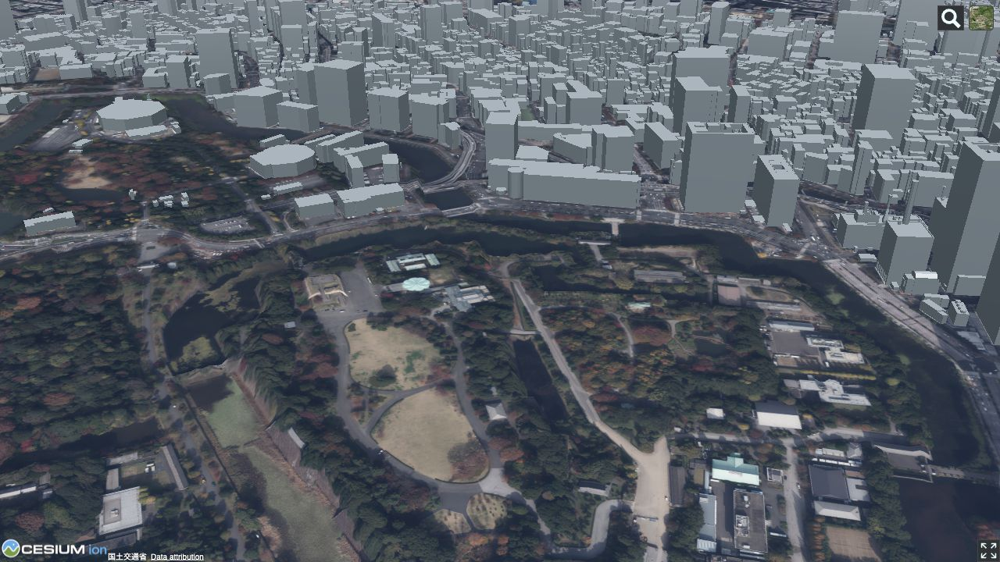
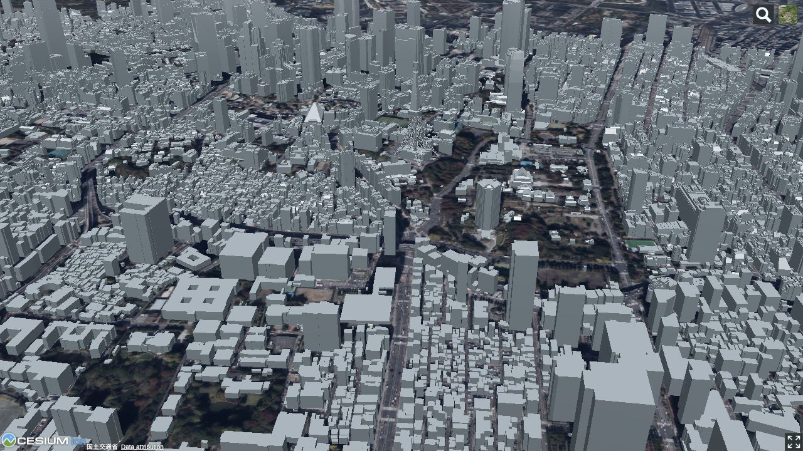

# `mille-plateaux` collection
## 01100_sapporo-shi_2020_bldg_low_resolution

## 01100_sapporo-shi_2020_bldg_notexture

## 01100_sapporo-shi_2020_bldg_texture

## 07204_iwaki-shi_2020_bldg_low_resolution

## 07204_iwaki-shi_2020_bldg_notexture

## 07204_iwaki-shi_2020_bldg_texture

## 09201_utsunomiya-shi_2020_bldg_low_resolution

## 09201_utsunomiya-shi_2020_bldg_notexture

## 09201_utsunomiya-shi_2020_bldg_texture

## 11326_moroyama-machi_2020_bldg_low_resolution

## 11326_moroyama-machi_2020_bldg_notexture

## 11326_moroyama-machi_2020_bldg_texture

## 13101_chiyoda-ku_2020_bldg_low_resolution

## 13101_chiyoda-ku_2020_bldg_notexture

## 13101_chiyoda-ku_2020_bldg_texture

## 13102_chuo-ku_2020_bldg_low_resolution

## 13102_chuo-ku_2020_bldg_notexture

## 13102_chuo-ku_2020_bldg_texture

## 13103_minato-ku_2020_bldg_low_resolution

## 13103_minato-ku_2020_bldg_notexture

## 13103_minato-ku_2020_bldg_texture

## 13104_shinjuku-ku_2020_bldg_low_resolution

## 13104_shinjuku-ku_2020_bldg_notexture

## 13104_shinjuku-ku_2020_bldg_texture

## 13105_bunkyo-ku_2020_bldg_notexture

## 13106_taito-ku_2020_bldg_notexture

## 13107_sumida-ku_2020_bldg_notexture

## 13108_koto-ku_2020_bldg_low_resolution

## 13108_koto-ku_2020_bldg_notexture

## 13108_koto-ku_2020_bldg_texture

## 13109_shinagawa-ku_2020_bldg_low_resolution

## 13109_shinagawa-ku_2020_bldg_notexture

## 13109_shinagawa-ku_2020_bldg_texture

## 13110_meguro-ku_2020_bldg_notexture

## 13111_ota-ku_2020_bldg_low_resolution

## 13111_ota-ku_2020_bldg_notexture

## 13111_ota-ku_2020_bldg_texture

## 13112_setagaya-ku_2020_bldg_notexture

## 13113_shibuya-ku_2020_bldg_low_resolution

## 13113_shibuya-ku_2020_bldg_notexture

## 13113_shibuya-ku_2020_bldg_texture

## 13114_nakano-ku_2020_bldg_notexture

## 13115_suginami-ku_2020_bldg_notexture

## 13116_toshima-ku_2020_bldg_low_resolution

## 13116_toshima-ku_2020_bldg_notexture

## 13116_toshima-ku_2020_bldg_texture

## 13117_kita-ku_2020_bldg_notexture

## 13118_arakawa-ku_2020_bldg_notexture

## 13119_itabashi-ku_2020_bldg_notexture

## 13120_nerima-ku_2020_bldg_notexture

## 13121_adachi-ku_2020_bldg_notexture

## 13122_katsushika-ku_2020_bldg_notexture

## 13123_edogawa-ku_2020_bldg_notexture

## 14100_yokohama-shi_2020_bldg_low_resolution

## 14100_yokohama-shi_2020_bldg_notexture

## 14100_yokohama-shi_2020_bldg_texture

## 14130_kawasaki-shi_2020_bldg_notexture

## 14150_sagamihara-shi_2020_bldg_notexture

## 15100_niigata-shi_2020_bldg_low_resolution

## 15100_niigata-shi_2020_bldg_notexture

## 15100_niigata-shi_2020_bldg_texture

## 17201_kanazawa-shi_2020_bldg_notexture

## 20202_matsumoto-shi_2020_bldg_low_resolution

## 20202_matsumoto-shi_2020_bldg_notexture

## 20202_matsumoto-shi_2020_bldg_texture

## 22203_numazu-shi_2020_bldg_low_resolution

## 22203_numazu-shi_2020_bldg_notexture

## 22203_numazu-shi_2020_bldg_texture

## 22203_numazu-shi_2021_bldg_low_resolution

## 22203_numazu-shi_2021_bldg_notexture

## 22203_numazu-shi_2021_bldg_texture

## 47201_naha-shi_2020_bldg_low_resolution

## 47201_naha-shi_2020_bldg_notexture

## 47201_naha-shi_2020_bldg_texture

